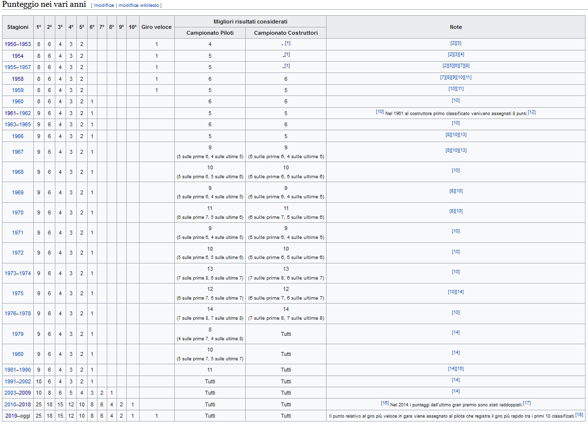

```{r setup, include=FALSE}
knitr::opts_chunk$set(echo = FALSE, warning = FALSE, message = FALSE)
```

```{r libraries, include=FALSE, message=FALSE, warning=FALSE}
library(knitr)
library(kableExtra)

library(tidyverse)
library(lubridate)

library(leaflet)
library(mapview)
library(sf)
library(geojsonsf)

library(showtext)
library(ggplot2)
library(plotly)
library(gganimate)
library(GGally)
library(viridis)
library(hrbrthemes)

library(rvest)
```
# Dataset di partenza

## Download ed estrazione

Il dataset di partenza viene scaricato da un [web service](http://ergast.com/mrd/) che lo mette a disposizione gratuitamente a fini non commericali.
Il dataset è contenuto in un archivio .zip. Utilizzando la funzione __unzip()__ il contenuto dell'archivio viene estratto per essere elaborato.

```{r download_unzip, message=FALSE, warning=FALSE}
url <- "http://ergast.com/downloads/f1db_csv.zip"
dest_file <- "./data/f1db_csv.zip"
#download.file(url, dest_file)
dest_dir <- "./data"
unzip(dest_file, exdir = dest_dir)
```

## Importazione dei dati

Dato il numero di csv viene automatizzato il processo di importazione dei file.

Viene creata la lista di file csv contenuti nella cartella "data":
```{r csv_list}
csv_list <- list.files("./data/", pattern= ".csv$")
csv_list
```

Un ciclo for compie delle operazioni su ogni csv:

1. Viene assegnato alla variabile file_path il path relativo per raggiungere il file csv;
1. Viene assegnato alla variabile tbl_name il nome del futuro dataframe che verrà creato a partire dal csv;
1. La funzione assign() assegna al dataframe con nome table_name il risultato della funzione read.csv().
```{r csv_to_df}
for(csv in csv_list) {
  file_path <- paste("./data/", csv, sep = "")
  tbl_name <- sub('\\.csv$', '', csv)
  assign(tbl_name, read.csv(file_path, encoding = "UTF-8", na.strings = "\\N"))
}
```

# Background sulla F1
## Cenni sullo sport
La F1 è uno degli sport automobilistici più famosi al mondo. Le gare si svolgono su circuiti internazionali stabiliti dalla Federazione Internazionale dell'Automobile (FIA) a bordo di vetture monoposto.

I piloti devono compiere una serie di giri lungo il percorso del circuito e concludere la gara nella miglior posizione possibile. Il numero di giri effettuati dalle vetture lungo il tracciato non è fisso ma viene calcolato in modo che siano il minimo numero possibile per eccedere la distanza di 305Km.

Al termine di ogni gara ai primi dieci piloti vengono assegnati un determinato numero di punti validi per la classifica piloti del campionato. Il pilota che ha accumulato più punti al termine della stagione riceve il titolo di campione del mondo della F1.

Parallelamente al campionato piloti si svolge il campionato costruttori dove i team accumulano i punti di ogni singolo pilota alla guida di una propria vettura.

Negli ultimi anni prendono il via 20 piloti divisi in 10 case costruttrici. Da regolamento sono anche previsiti piloti di riserva che possono subentrare nel caso di problemi di un pilota ufficiale.

##  Il giro d'affari della F1
Il report finanziario annuale 2019 di Liberty Media (proprietaria della F1) riporta un ricavo di __2,022 bilioni USD__ (pagina 96 del [report](https://ir.libertymedia.com/static-files/2aeaccfa-a5e5-4fd4-abd1-eaa9dad5d6c0)).

I ricavi si dividono principalmente in:

- __diritti televisivi__ 
- __tasse di partecipazione__ che i singoli circuiti pagano alla F1 per poter ospitare un GP
- __vendita di biglietti__
- __sponsorizzazioni__

I singoli costruttori hanno dei ricavi annui che vanno dai 70 milioni USD ai __500 milioni USD__, originati da tre fattori principali:

- __sponsorizzazioni__
- __ricavi della F1__ divisi ogni finale di stagione a seconda degli accordi commericali tra Formula One Group e i singoli team
- __singoli piloti__ che nei team di fascia medio-bassa arrivano a pagare milioni di dollari per poter salire su una monoposto

# La stagione attuale
## La F1 e il Sars-CoV-2
La pandemia globale che stiamo affrontando ha messo in difficoltà anche il mondo dello motorsport. Questo ha causato uno slittamento dell'inizio della stagione e una riduzione drastica dei circuiti a disposizione, costringendo la FIA ad organizzare gare multiple su alcuni circuiti (Spielberg, Silverstone e Manama), ad escludere circuiti di importanza storica come Monaco e ad assegnare all'Italia ben 3 gare su altrettanti circuiti (Monza, Imola e Mugello).

Ad oggi ci sono in calendario 17 gare e difficilmente se ne aggiungeranno altre

## I team 2020
```{r, out.height = "100%", out.width = "100%"}
constructor_championships <- constructors %>%
  left_join(
    left_join(
      constructor_standings,
      select(races, raceId, year),
      by = "raceId") %>%
      filter(year < 2020) %>%
      group_by(year) %>%
      filter(raceId == max(raceId)) %>%
      filter(position == 1) %>%
      ungroup() %>%
      group_by(constructorId) %>%
      count(),
    by = "constructorId"
            ) %>%
  select(constructorId, name, nationality, championships = n) %>%
  replace(is.na(.), 0) %>%
  arrange(desc(championships))

constructor_championships %>%
  semi_join(
    constructor_standings %>%
      filter(raceId == max(raceId)),
    by = "constructorId"
  ) %>%
  mutate(championships = replace(championships, championships == 0, 0.3)) %>%
  mutate(name = fct_reorder(name, championships), nationality = as.factor(nationality)) %>%
  ggplot(aes(x = name, y = championships, fill = nationality)) +
    geom_bar(stat = "identity") +
    coord_flip() + 
    theme_ipsum() + 
    xlab("") + 
    scale_fill_viridis_d(option = "C") +
    scale_y_continuous(breaks = seq(0, 16, by = 2))
```

## I piloti 2020
```{r, out.height = "100%", out.width = "100%"}
drivers_2020 <- drivers %>%
  left_join(
    left_join(
      driver_standings,
      select(races, raceId, year),
      by = "raceId") %>%
      filter(year < 2020) %>%
      group_by(year) %>%
      filter(raceId == max(raceId)) %>%
      filter(position == 1) %>%
      ungroup() %>%
      group_by(driverId) %>%
      count(),
    by = "driverId"
            ) %>%
  select(driverId, forename, surname, dob, nationality, championships = n) %>%
  mutate(dob = year(as.Date(dob))) %>%
  replace(is.na(.), 0) %>%
  arrange(desc(championships))

drivers_2020 <- drivers_2020 %>%
  semi_join(
    driver_standings %>%
      filter(raceId == max(raceId)),
    by = "driverId"
  )

drivers_2020 <- drivers_2020 %>%
  left_join(
    results %>%
      left_join(select(races, raceId, year), by = "raceId") %>%
      semi_join(drivers_2020, by = "driverId") %>%
      group_by(driverId) %>%
      filter(year == min(year)) %>%
      distinct(year) %>%
      rename(firstRace = year),
    by = "driverId")

plot <- drivers_2020 %>%
  ggplot(aes(text = sprintf("driver: %s %s", forename, surname) , x = dob, y = firstRace, size = championships, color = nationality)) + 
    geom_point() + 
    scale_size(range = c(3, 10)) +
    theme_ipsum() +
    scale_x_continuous(breaks = seq(1970, 2000, by = 2)) +
    scale_y_continuous(breaks = seq(2000, 2020, by = 2))

ggplotly(plot)
```

# Geografia della F1
##
Quest'anno ricorre il 70° anniversario della prima gara ufficiale del campionato di F1
```{r first_race}
races %>%
  arrange(date) %>%
  slice_head() %>%
  left_join(circuits, by = "circuitId", suffix = c("_gp", "_circuit")) %>%
  select(date, name_gp, name_circuit) %>%
  kable() %>%
  kable_minimal()
```


Da allora la F1 ha gareggiato in tutti i continenti (Antartide esclusa, ovviamente...) arrivando a totalizzare __`r races %>% filter(date < as.character(Sys.Date())) %>% select(raceId) %>% nrow()`__ gare (numero generato automaticamente a partire dal df __races__)

Per poter apprezzare in modo significativo la distribuzione dei GP nel mondo è possibile creare una mappa utilizzando la libreria __leaflet__.
La mappa può essere anche arricchita di informazioni per rendere la sua esplorazione più significativa. A tal fine è stato deciso di:

1. Mostrare le occorrenze di ogni singolo GP su un determinato circuito
1. Trovare il numero di GP che uno stato ha ospitato
1. Individuare l'ultimo vincitore di un GP (nome, cognome, anno di vittoria e costruttore della vettura)

## Occorrenze di ogni GP
```{r circuits_stat, message=FALSE}
circuits_stat <- races %>%  # races è un buon punto di partenza, contiene le informazioni essenziali su ogni gara svoltasi nei 70 anni della F1
  group_by(circuitId, name) %>%  # raggruppamento per id del circuito e nome
  count(sort = TRUE) %>%  # conteggio delle gare disputate in ogni gruppo
  rename(gp_num = n) %>%  # viene rinominata la colonna prodotta dal count
  ungroup() %>%
  inner_join(circuits, by = "circuitId") %>%  # join delle informazioni specifiche dei circuiti dal df circuits
  rename(gp_name = name.x, circuit_name = name.y) %>%  # entrambi i df contengono la colonna name, vengono rinominate correttamente
  select(-url, -alt, -circuitRef) %>%  # esclusione delle colonne superflue
  arrange(desc(gp_num))

kable(circuits_stat) %>%
  kable_minimal(c("striped", "hover", "condensed", "responsive"), font_size = 15) %>%
  scroll_box(width = "100%", height = "500px")
```

## Occorenze per stato
```{r world_distribution, message=FALSE}
gp_per_country <- circuits_stat %>%
  select(gp_num, country) %>%  # L'unico interesse, in questo caso, è sapere quante gare ha ospitato uno stato. Si seleziona dunque solo la colonna numero di gp (riferiti ad un circuito) e lo  stato in cui il circuito è localizzato
  group_by(country) %>% # raggruppo per stato
  summarise(gp_num = sum(gp_num)) %>%  # gp_num diventa la somma dei gp_num ospitati dai circuiti di uno stato
  ungroup() %>%
  arrange(desc(gp_num)) # ordinamento del df in modo decrescente rispetto a gp_num
kable(gp_per_country) %>%
  kable_minimal(c("striped", "hover", "condensed", "responsive"), font_size = 15) %>%
  scroll_box(width = "100%", height = "500px")
```

## Italia al primo posto
Dall'analisi delle occorrenze fatta in precedenza è possibile osservare come l'Italia sia prima per numero di occorrenze di un singolo GP `r circuits_stat %>% slice_head() %>% select(gp_num, circuit_name) %>% kable() %>% kable_minimal(c("striped", "hover", "condensed", "responsive"), font_size = 15) %>% scroll_box(width = "100%")`
e anche prima valutando i GP per stato `r gp_per_country %>% slice_head() %>% kable() %>% kable_minimal(c("striped", "hover", "condensed", "responsive"), font_size = 15) %>% scroll_box(width = "100%")`  

Questo primato è frutto di diversi fattori:

1. **scuderie italiane**: la costante presenza di costruttori italiani vincenti e prestazionali nelle stagioni di F1 costringe la FIA ad inserire in calendario una gara in Italia;
2. **fattore tecnico**: l'Autodromo Nazionale di Monza è rinnomato per le sue caratteristiche tecniche
    + quattro lunghi rettilinei sui quali le auto toccano velocità superiori a 350 km/h
    + curve che costringono i piloti a passare dalla velocità di punta a 60/70 km/h in circa 2.5 secondi
3. **pubblico**: la fama del circuito di Monza attira un numero gigantesco di amanti dei motori che si traduce in guadagni notevoli per la F1 (nel 2019 l'autodromo ha superato le 200.000 presenze con un prezzo medio per biglietto di €235)

## Arricchimento dei dati per la mappa
Per rendere la mappa più significativa è stato deciso di aggiungere alcuni dati dell'ultimo vincitore di ogni GP:

+ nome
+ cognome
+ anno di vittoria
+ costruttore dell'auto

## I vincitori
Il primo passo è isolare da tutti i risultati delle gare (contenuti nella tabella results) i risultati relativi ai primi classificati (i vincitori della gara)
```{r}
winners <- results %>%
  filter(position == 1) %>%  # partendo dal df con i risultati di ogni gara per ogni pilota vengono trovati tutti quelli cha hanno occupato la posizione 1
  select(raceId, driverId, constructorId)  # vengono selezionate le sole colonne necessarie
# N.B. i dati sono id, ovvero riferimenti ad altre tabelle

kable(winners) %>%
  kable_minimal(c("striped", "hover", "condensed", "responsive"), font_size = 15) %>%
  scroll_box(width = "100%", height = "300px")
```

## Ultima occorrenza di un GP in un determinato circuito
Per come sono strutturate le denominazioni delle gare della F1 e rendere la mappa il più possibile completa, è necessario abbinare un GP ad uno specifico circuito. Partendo da questo presupposto sono state isolate le utlime occorrenze dei GP

```{r}
gp_last_occurence <- races %>%
  group_by(circuitId, name) %>%  # raggruppamento per id circuito e nome
  filter(date < as.character(Sys.Date())) %>%
  filter(year == max(year)) %>%  # filtro per cercare l'anno massimo in un gruppo, ovvero l'ultima gara svoltasi su un circuito
  select(-time, -url, -round, -date) %>%  # vengono scartate le colonne superflue
  ungroup()

kable(gp_last_occurence) %>%
  kable_minimal(c("striped", "hover", "condensed", "responsive"), font_size = 15) %>%
  scroll_box(width = "100%", height = "290px")
```

## I vincitori delle ultime occorrenze dei GP
Partendo dai due data frame ottenuti in precedenza si può ora spaere chi ha vinto l'ultima occorrenza di una gara
```{r}
gp_last_occurence <- left_join(gp_last_occurence, winners, by = "raceId") %>%  # left_join delle due tabelle appena costruite
  left_join(select(drivers, driverId, forename, surname), by = "driverId") %>%  # left_join della tabella drivers delle variabili nome e cognome dei piloti
  rename(gp_name = name) %>%
  left_join(select(constructors, constructorId, name), by = "constructorId") %>%  # left_join dalla tabella constructors del nome del costruttore dell'auto
  rename(constructor = name) %>%
  ungroup()

circuits_stat <- left_join(circuits_stat, gp_last_occurence, by = c("circuitId", "gp_name"))

kable(circuits_stat) %>%
  kable_minimal(c("striped", "hover", "condensed", "responsive"), font_size = 15) %>%
  scroll_box(width = "100%", height = "300px")
```

## Ci siamo quasi...
Per poter realizzare la mappa della distribuzione dei GP nel mondo sono necessari ancora alcuni dettagli:

+ per disegnare i poligoni corrispondenti agli stati viene utilizzato un file __.geojson__ contenente le coordinate dei punti che delimitano i confini nazionali
```{r}
world_borders  <- geojson_sf("./data/countries.geojson")
```
+ le sigle di alcuni Paesi, contenute nelle tabelle create in precedenza, vanno modificate e riscritte per intero (UK, USA, UAE, Korea)
```{r}
gp_per_country$country[gp_per_country$country == "Korea"] <- "South Korea"
gp_per_country$country[gp_per_country$country == "UK"] <- "United Kingdom"
gp_per_country$country[gp_per_country$country == "UAE"] <- "United Arab Emirates"
gp_per_country$country[gp_per_country$country == "USA"] <- "United States of America"
```
+ ai dati del __.geojson__ vanno uniti i dati relativi al numero di GP ospitati dagli stati per poter manipolare le opzioni delle funzione della libreria leaflet in maniera agevole

Di seguito viene mostrato un esempio di quanto fatto
```{r}
world_borders <- right_join(world_borders, gp_per_country, by = c("ADMIN" = "country"))

kable(world_borders[1:1,]) %>%
  kable_minimal(c("striped", "hover", "condensed", "responsive"), font_size = 15) %>%
  scroll_box(width = "100%")
```

## Distribuzione globale dei GP
```{r}
pal <- colorBin("viridis", world_borders$gp_num)  # Palette di colori che servirà per riempire gli stati in base al numero di gare che hanno ospitato

labels <- sprintf(
  "<strong>%s</strong><br/>%d GPs",
  world_borders$ADMIN, world_borders$gp_num
) %>% lapply(htmltools::HTML)  # Etichette formattate in HTML da utilizzare all'hovering di uno stato con il mouse

map <-leaflet(world_borders , options = leafletOptions(minZoom = 2), width = "100%") %>%  # Alcune opzioni per la mappa: zoom minimo e larghezza nella pagina
  addTiles() %>%
  setView(15, 20, 2) %>%  # Posizione e zoom iniziale
  addAwesomeMarkers(circuits_stat$lng, # Alle coordinate di ogni circuito posiziono un marker
                    circuits_stat$lat,
                    label = circuits_stat$gp_num,
                    labelOptions = labelOptions(noHide = T, direction = "bottom"), # Il marker presenta il numero di gare disputate in quel circuito con il nome di un certo gran premio
                    popup = paste("<b>",
                                  as.character(circuits_stat$circuit_name),
                                  "</b><br/>",
                                  as.character(circuits_stat$gp_name),
                                  "<br/><b>Last winner:</b> ",
                                  as.character(circuits_stat$forename),
                                  " ",
                                  as.character(circuits_stat$surname),
                                  " (",
                                  as.character(circuits_stat$year),
                                  ")<br/><b>Constructor:</b> ",
                                  as.character(circuits_stat$constructor),
                                  sep = ""),  # Cliccando su un marker viene visualizzato un popup che contiene alcune informazioni: nome circuito, gran premio ospitato, ultimo vincitore (anno) e costruttore della vettura
                    clusterOptions = markerClusterOptions()) %>%  # Vengono aggiunti i cluster che raccolgono i circuiti in una certa area geografica
  addPolygons(color = '#ffffff',  # Aggiunta dei confini degli stati
              weight = 1,
              opacity = 0.5,
              fillColor = ~pal(gp_num),  # Il colore di riempimento è basato su una scala colore viridis di cui è presentata la legenda
              fillOpacity = 0.7,
              highlight = highlightOptions(  # Opzioni all'hovering dello stato
                weight = 5
              ),
              label = labels) %>%  # Assegnazione delle etichette preparate in precedenza
  addLegend("bottomright", pal = pal, values = ~gp_num,  # Viene visualizzata la legenda colore
            title = "Num. of GPs",
            opacity = 1) %>%
  addControl(html = "<b>Each cluster represents the number of ciruits in a geographical area</br>
                     Each marker is clicable and indicates the number of races in that specific circuit</b>", "bottomleft")  # Per facilitare la lettura della mappa stand-alone è stata scritta una piccola guida
map 
```

# I progressi tecnici della F1
## Tecninca al limite
In 70 anni di storia, la F1 è diventata famosa per aver spinto al massimo i limiti tecnico-ingegneristici della costruzione delle automobili da corsa (ai progressi pionieristici della F1 in ambito di sistemi di propulsione si deve la nascita dei sistemi ibridi che troviamo sulle auto commerciali).

I limiti tecnici non sono "naturali" ma vengono fiassati dall FIA in modo da garantire un alto livello di spettacolarità dello sport e un altrettanto alto livello di sicurezza per i piloti.

## Tempi sui giri
```{r, out.height = "100%", out.width = "100%"}
monza_laps <- lap_times %>%
  left_join(select(races, raceId, circuitId, year), by = "raceId") %>%
  left_join(select(circuits, circuitId, circuitRef), by = "circuitId") %>%
  filter(circuitRef == "monza") %>%
  group_by(driverId, year) %>%
  filter(milliseconds == min(milliseconds))

kable(monza_laps) %>%
  kable_minimal(c("striped", "hover", "condensed", "responsive"), font_size = 15) %>%
  scroll_box(width = "100%", height = "500px")

limits <- monza_laps %>%
  group_by(year) %>%
  summarise(q3 = quantile(milliseconds, 3/4), q0 = milliseconds) %>%
  ungroup() %>%
  summarise(low = min(q0), highQ3 = max(q3))

monza_laps %>%
  select(milliseconds, year) %>%
  ggplot(aes(x = as.factor(year), y = milliseconds)) +
  geom_boxplot() +
  ylim(as.numeric(limits)) +
  ylab("Lap time [millisecoinds]") +
  xlab("Year") +
  theme_ipsum() +
  theme(axis.text.x = element_text(angle = 90))
```

```{r , out.height = "100%", out.width = "100%"}
monza_q <- qualifying %>%
  left_join(select(races, raceId, circuitId, year), by = "raceId") %>%
  left_join(select(circuits, circuitId, circuitRef), by = "circuitId") %>%
  filter(circuitRef == "monza") %>%
  gather(key = "part", value = "time", q1, q2, q3) %>%
  select(driverId, time, year) %>%
  filter(time != "")

toSeconds <- function(x){
  if (length(x) <= 0)
    return(x)
  unlist(
    lapply(x,
           function(i){
             s <- as.numeric(strsplit(i,':',fixed=TRUE)[[1]])
             s[1]*60000 + s[2]*1000
           }
    )
  )
}

monza_q$milliseconds = toSeconds(monza_q$time)

kable(monza_q) %>%
  kable_minimal(c("striped", "hover", "condensed", "responsive"), font_size = 15) %>%
  scroll_box(width = "100%", height = "500px")

limits <- monza_q %>%
  group_by(year) %>%
  summarise(q3 = quantile(milliseconds, 3/4), q0 = milliseconds) %>%
  ungroup() %>%
  summarise(low = min(q0), highQ3 = max(q3))

monza_q %>%
  select(milliseconds, year) %>%
  ggplot(aes(x = as.factor(year), y = milliseconds)) +
  geom_boxplot() +
  ylim(as.numeric(limits)) +
  ylab("Lap time [millisecoinds]") +
  xlab("Year") +
  theme_ipsum() +
  theme(axis.text.x = element_text(angle = 90))
```

# La classifica dei campioni
<div class="gray">
Un dibattito molto acceso all'interno del mondo della F1 è chi sia il miglior pilota di sempre. Nel web è possibile trovare diverse classifiche, la maggior parte delle quali stilate secondo un metodo basato principalmente sulla valutazione dello stile di guida dei piloti e la conta di campionati del mondo vinti.

Il principale obbiettivo di questa sezione è costruire un indice complesso di pregio dei piloti basato interamente sui dati raccolti.
</div>

## Integrazione del dataset iniziale | Il sistema di punteggio della F1
Un'aspetto che non viene trattato nel dataset di partenza è il sistema di punteggio della F1. Utilizzando R e alcune librerie per il parsing di HTML è stato deciso di integrare il dataset originale in modo da poter avere ulteriori informazioni per stabilire il miglior pilota F1

Su Wikipedia è presente una [pagina](https://it.wikipedia.org/wiki/Sistema_di_punteggio_della_Formula_1) contenente la tabella con i sistemi di punteggio utilizzati dal 1950 ad oggi

{width=100%}

La pagina viene scaricate e la tabellla contenuta in essa viene estratta
```{r}
url <- 'https://it.wikipedia.org/wiki/Sistema_di_punteggio_della_Formula_1'
wiki_page <- read_html(url) # Download della pagina
point_scoring_system <- html_nodes(wiki_page, '.wikitable') # Estrazione del contenitore della tabella
point_scoring_system <- point_scoring_system %>% .[[1]] # Estrazione della tabella
point_scoring_system <- point_scoring_system %>% html_table(header = TRUE, fill = TRUE) # Conversione primitiva della tabella in dataframe

kable(point_scoring_system) %>%
  kable_minimal(c("striped", "hover", "condensed", "responsive"), font_size = 15) %>%
  scroll_box(width = "100%", height = "500px")
```

Come si può notare, la tabella convertita in dataframe è inutilizzabile così com'é e viene dunque effettuata una complessa elaborazione:

1. Cambio di nome ad alcune colonne e riformattazione delle colonne con header una posizione;
1. Tutte le celle vuote vengono riempite con uno zero
1. Gli intervalli di anni vengono espansi e riempiti con i valori congrui
1. Dal df __race__ viene ottenuto il numero di gare stagionali e aggiunto alla tabella
1. Conversione dei dati contenuti nel df da char a int

Si ottiene alla fine delle operazioni la seguente tabella
```{r}
point_scoring_system <- point_scoring_system %>% 
  rename("validForDrivers" = 13, "validForConstructors" = 14, year = Stagioni, fastLap = "Giro veloce") %>%
  rename_all(~str_replace(., "(\\d+)(°)", "n\\1")) %>%  # Conversione dei nomi delle colonne da x a nx
  select(-Note) %>%  # La colonna "Note" serve
  slice(2:n())  # La prima riga è il tentativo di html_table() nel gestire la doppia riga di header. E' necessario pertanto escluderla e quindi viene effettuato lo slice sulle restanti righe

point_scoring_system <- point_scoring_system %>% 
  mutate(validForDrivers = gsub("\\(.*", "", validForDrivers),
         validForConstructors = gsub("\\(.*|-.*", "", validForConstructors),
         year = gsub("–\\d+$|–\\w+", "", year))

point_scoring_system <- point_scoring_system %>%
  mutate_all(~replace(., . == "", "0")) %>% 
  mutate(year = as.integer(year))

point_scoring_system <- point_scoring_system %>%
  right_join(races %>%  # Elaborazione  di races in modo da ottenere il numero di gare stagionali
    filter(date < Sys.Date()) %>%
    group_by(year) %>%
    count() %>%
    rename(rounds = n), by = "year") # right_join per mantenere le righe già presenti e aggiungere le righe che corrispondevano ad annate prima incluse in un intervallo

point_scoring_system <- point_scoring_system %>%
  arrange(year) %>% # Ordinamento in modo crescente rispetto all'anno
  fill(2:14) # Le righe nuove, derivanti dal right_join, non contengono valori (ad esclusione delle colonne year e rounds). Tuttavia, i valori necessari a riempire una riga vuota sono contenuti nella prima riga non-vuota in alto. Con la funzione fill() vengono riempiti i vuoti

point_scoring_system <- point_scoring_system %>%
  group_by(year) %>%
  mutate(validForDrivers = replace(validForDrivers, validForDrivers == "Tutti", rounds),
         validForConstructors = replace(validForConstructors, validForConstructors == "Tutti", rounds)) %>% # Vengono sostituite nelle colonne delle gare valide per il titolo di campione e il titolo costruttori tutte le occorrenze di "Tutti" con il corrispondente numero di gare della stagione
  ungroup() %>%
  mutate_all(~as.integer(.))

kable(point_scoring_system) %>%
  kable_minimal(c("striped", "hover", "condensed", "responsive"), font_size = 15) %>%
  scroll_box(width = "100%", height = "500px")
```

La tabella risulta ora utilizzabile e ben formattata

## Numero di piloti
Per il calcolo di alcuni indici è necessario sapere il numero di piloti che parteciano ogni anno ad un campionato. Operando un join tra la tabella __driver_standings__ e la tabella __races__ si associa ad ogni standing del pilota l'anno in cui gareggia

```{r}
drivers_each_year <-
  inner_join(driver_standings, select(races, year, raceId), by = "raceId") %>%
  select(year, driverId) %>%
  mutate(driverId = as.character(driverId))

kable(drivers_each_year) %>%
  kable_minimal(c("striped", "hover", "condensed", "responsive"), font_size = 15) %>%
  scroll_box(width = "100%", height = "300px")
```

Il regolamento F1 consente ad un pilota di riserva di subentrare in caso di problemi con uno dei piloti ufficiali, per questo non è possibile a priori prendere a campione una gara dell'annata per contare gli id ma è più sicuro fare un'analisi di tutte le gare e operare un distinct() per prendere in modo univoco gli id dei piloti che hanno partecipato ad almeno una gara. Vengono poi contati tutti gli __id__ raggruppati per anno

```{r}
drivers_each_year <- drivers_each_year %>%
  distinct() %>%
  count(year) %>%
  rename(nDrivers = n) %>%
  ungroup()

kable(drivers_each_year) %>%
  kable_minimal(c("striped", "hover", "condensed", "responsive"), font_size = 15) %>%
  scroll_box(width = "100%", height = "300px")
```

## Statistiche aggiuntive per il sistema di punteggio
E' necessario stabilire alcune statistiche da inserire nella tabella dei punteggi che saranno poi utili nel momento in cui dovrà essere stabilito il miglior pilota della F1.

Per prima cosa viene aggiunta alla tabella con il sistema di punteggio il numero di piloti che hanno gareggiato durante la stagione. Di seguito l'esempio della prima riga del dataframe
```{r}
point_scoring_system <- point_scoring_system %>%
  left_join(drivers_each_year, by = "year")

point_scoring_system %>% 
  slice_head() %>%
  kable() %>%
  kable_minimal(c("striped", "hover", "condensed", "responsive"), font_size = 15) %>%
  scroll_box(width = "100%")
```
Viene quindi calcolato:

+ il numero massimo di punti che un pilota può ottenere (arrivando sempre primo e stabilendo il giro veloce su ogni tracciato)
+ il numero massimo di punti che un costruttore può ottenere (quanto i piloti arrivano sempre primo e secondo)
+ il numero di punti disponibili in tutto il mondiale
```{r}
point_scoring_system <- point_scoring_system %>%
  group_by(year) %>%
  mutate(maxDriversPoints = n1 * validForDrivers + fastLap * rounds) %>%
  mutate(maxConstructrosPoints = n1 * validForConstructors + n2 * validForConstructors) %>%
  mutate(availableDriversPoints = (n1 + n2 + n3 + n4 + n5 + n6 + n7 + n8 + n9 + n10 + fastLap) * validForDrivers) %>%
  ungroup()

kable(point_scoring_system) %>%
  kable_minimal(c("striped", "hover", "condensed", "responsive"), font_size = 15) %>%
  scroll_box(width = "100%", height = "300px")
```

## Trovare i campioni
Il dataset in dotazione non contiene tabelle che riassumano chi sono i vincitori dei campionati e tutte le statistiche riassuntive legati ad essi.
Per ovviare a questa mancanza e vista la struttura del dataset è necessario utilizzare il seguente approccio:

1. Trovare la lista degli id delle ultime gare di una stagione a partire dal df __races__
```{r}
last_race_ids <- races %>%
  filter(date < Sys.Date()) %>%
  group_by(year) %>%
  filter(round == max(round)) %>%
  select(year, raceId) %>%
  arrange(year) %>%
  ungroup()

kable(last_race_ids) %>%
  kable_minimal(c("striped", "hover", "condensed", "responsive"), font_size = 15) %>%
  scroll_box(width = "100%", height = "300px")
```

1. Fare un join della lista appena trovata e il df __driver_standings__ per trovare le classifiche dopo l'ultima gara di ogni stagione e isolare il pilota con position == 1 per ogni anno
```{r}
champions <- 
  inner_join(driver_standings, last_race_ids, by = "raceId") %>%  # isolamento delle classifiche dopo l'ultima gara dell'anno
  group_by(year) %>%
  filter(position == 1) %>%  # vengono filtrati i soli campioni del mondo (primi dopo l'ultima gara)
  left_join(select(results, driverId, raceId, constructorId), by = c("driverId", "raceId")) %>%  # vengono integrate le informazioni sui piloti con il constructorId
  select(year, driverId, constructorId, seasonWins = wins, seasonPoints = points, raceId) %>% # selezione e riordinamento delle variabili
  arrange(year) %>%
  distinct() %>%
  ungroup()

champions$constructorId[champions$year == 1961] = 6
champions$constructorId[champions$year == 1977] = 6
champions$constructorId[champions$year == 1970] = 32

kable(champions) %>%
  kable_minimal(c("striped", "hover", "condensed", "responsive"), font_size = 15) %>%
  scroll_box(width = "100%", height = "300px")
```

Nei primi anni della F1 era possibile sostituire il pilota alla guida di una vettura, della stessa casa produttrice, durante una gara, questo permetteva ai piloti di "rubare" il posto ad un compagno se questo era più avantaggiato. Nelle tabelle questo porta a dei doppi risultati per alcuni piloti. Per ovviare a questo problema è stato operato un distinct() perché uno di questi piloti è sato campione del mondo

Ci sono stati tre campioni della F1 che per vari problemi non hanno partecipato all'ultima gara, l'autore del dataset ha deciso di non inserire in races un entry per questi piloti. Anche questo problema è stato corretto in precedenza

## Numero di vittorie
Il primo indice calcolato è stato il numero di vittorie rispetto al numero di gare effettuate

Per trovare il numero di gare effettuato è bastato contare in __results__ il numero di apparizione di ogni id corrispondente ad un pilota campione del mondo

```{r}
champions <- champions %>%
    left_join(
        left_join(results, select(races, raceId, year), by = "raceId") %>%
        semi_join(select(champions, driverId), by = "driverId") %>%
        group_by(year, driverId) %>%
        count() %>%
        group_by(driverId) %>%
        mutate(starts = cumsum(n)),
      by = c("driverId", "year")
    ) %>%
    select(-n)

kable(champions) %>%
  kable_minimal(c("striped", "hover", "condensed", "responsive"), font_size = 15) %>%
  scroll_box(width = "100%", height = "300px")

```

Il numero di vittorie è anch'esso contenuto nel df __results__: isolati i risultati con position == 1 e ragruppando per pilota, è necessario contare il numero di occorrenze
```{r}
champions <- champions %>%
  left_join(
    left_join(results, select(races, raceId, year), by = "raceId") %>%
      semi_join(select(champions, driverId), by = "driverId") %>%
      filter(position == 1) %>%
      group_by(year, driverId) %>%
      count() %>%
      group_by(driverId) %>%
      mutate(wins = cumsum(n)) %>%
      select(-n),
    by = c("driverId", "year")
)

kable(champions) %>%
  kable_minimal(c("striped", "hover", "condensed", "responsive"), font_size = 15) %>%
  scroll_box(width = "100%", height = "300px")

```

A conclusione è necessario calcolare l'indice di vittorie
```{r}
champions <- champions %>%
  mutate(winsRate = wins/starts)

kable(champions) %>%
  kable_minimal(c("striped", "hover", "condensed", "responsive"), font_size = 15) %>%
  scroll_box(width = "100%", height = "300px")
```

## Contributo dei campioni ai team
Un indice interessante per valutare le performance di un pilota è il rapporto $$ punti\;pilota / punti\;squadra $$ che fornisce una misura del grado di bravura del pilota rispetto al compagno di squadra (importante è sottolineare che i piloti utilizzano due vetture identiche e varia solo l'assetto in funzione del circuito)

Per calcolare tale indice vengono inizialmente aggiunte delle informazioni al df champions
```{r}
champions <- champions %>%
  left_join(select(drivers, forename, surname, driverId), by = "driverId") %>%
  left_join(select(constructors, constructorId, constructor = name), by = "constructorId") %>%
  left_join(select(constructor_standings, raceId, constructorId, constructorPoints = points, position), by = c("constructorId", "raceId")) %>%
  arrange(year)

kable(champions) %>%
  kable_minimal(c("striped", "hover", "condensed", "responsive"), font_size = 15) %>%
  scroll_box(width = "100%", height = "300px")
```

Dal point_scoring_system e dal df precedente è evidente come nei primi 8 anni della F1 non si sia disputato il campionato costruttori. Il campionato costruttori si svolge parallelamente a quello piloti e consta nel cumulo dei punti di TUTTI i piloti che corrono per una scuderia. Dato che il sistema di ranking che è stato previsto per determinare il campione dei campioni necessita del numero di punti nel campionato costruttori viene fatta manualmente la proiezione dei punti che i piloti avrebbero portato al proprio costruttore.

Inizialmente è cruciale sapere quali sono i costruttori per cui i campioni del mondo gareggiavano, viene effettuato un select e un filtro per determinare tali constrtuttori

```{r}
fill_the_gap <- champions %>%
  select(year, constructorId) %>%
  filter(year < 1958)

kable(fill_the_gap) %>%
  kable_minimal(c("striped", "hover", "condensed", "responsive"), font_size = 15) %>%
  scroll_box(width = "100%", height = "300px")
```

Vengono poi unite le informazioni sulle gare in cui hanno partecipato le vetture di un costruttore, in paricolare è necessario sapere in quali posizioni hanno concluso i piloti della casa costruttrice.

```{r}
fill_the_gap <- fill_the_gap %>%
  left_join(select(races, year, raceId), by = "year") %>%
  left_join(select(results, raceId, constructorId, position), by = c("constructorId", "raceId"))

kable(fill_the_gap) %>%
  kable_minimal(c("striped", "hover", "condensed", "responsive"), font_size = 15) %>%
  scroll_box(width = "100%", height = "300px")
```

Di tutte le gare individuate vengono filtrate quelle in cui i piloti sono arrivati almento quinti (come si può notare dalla tabella point_scoring_system, tra il 1950 e il 1957 solo i piloti arrivati almeno quinti ottenenvano dei punti) e la variabile position viene convertita in modo da essere equivalente al nome delle colonne in point_scoring_system

```{r}
fill_the_gap <- fill_the_gap %>%
  filter(position <= 5) %>%
  mutate(position = str_replace(position, "(\\d+)", "n\\1"))

kable(fill_the_gap) %>%
  kable_minimal(c("striped", "hover", "condensed", "responsive"), font_size = 15) %>%
  scroll_box(width = "100%", height = "300px")
```

Sapendo ora la posizione dei piloti è necessario associare i punti guadagnati. Viene dunque fatto un join tra la tabella point_scoring_system in cui le colonne sono state trasformate in righe e fill_the_gap
```{r}
fill_the_gap <- fill_the_gap %>%
 left_join(select(gather(point_scoring_system, key = 'position', value = 'points', n1:n10), year, position, points), by = c('year', 'position')) %>%
  select(-position, -raceId)

kable(fill_the_gap) %>%
  kable_minimal(c("striped", "hover", "condensed", "responsive"), font_size = 15) %>%
  scroll_box(width = "100%", height = "300px")
```

Avendo ora i punti che ogni pilota della scuderia ha accumulato, è sufficiente raggruppare in base all'anno (ogni anno un solo pilota vince il campionato e di conseguenza vi è un solo costruttore per anno) e fare la somma dei punti di ogni pilota per ottenere i punti totali
```{r message=FALSE}
fill_the_gap <- fill_the_gap %>%
  group_by(year) %>%
  summarise(constructorPoints = sum(points)) %>%
  ungroup()

kable(fill_the_gap) %>%
  kable_minimal(c("striped", "hover", "condensed", "responsive"), font_size = 15) %>%
  scroll_box(width = "100%", height = "300px")
```

Ora, ai dati sui campioni del mondo, vengono uniti i risultati ottenuti in precedenza per completare il df
```{r}
champions <- champions %>%
  left_join(fill_the_gap, by = 'year') %>%
  mutate(constructorPoints = ifelse(is.na(constructorPoints.y), constructorPoints.x, constructorPoints.y)) %>% 
  select(-constructorPoints.x, -constructorPoints.y) %>%
  left_join(select(point_scoring_system, year, maxDriversPoints, availableDriversPoints, rounds, nDrivers), by = "year") %>%
  unite(driver, forename, surname, sep = " ")

kable(champions) %>%
  kable_minimal(c("striped", "hover", "condensed", "responsive"), font_size = 15) %>%
  scroll_box(width = "100%", height = "300px")
```
Completata l'integrazione del df __champions__ con i punti del campionato costruttori mancanti è possibile calcolare l'indice __ability__ che da un'idea del grado di abilità del pilota
```{r}
champions <- champions %>%
  mutate(ability = seasonPoints/constructorPoints)

kable(champions) %>%
  kable_minimal(c("striped", "hover", "condensed", "responsive"), font_size = 15) %>%
  scroll_box(width = "100%", height = "300px")
```
## Punti cumulati
Un'indice di efficienza di un pilota è sicuramente il rapporto tra i punti cumulati in una stagione e il numero di punti disponibili per il vincitore di tutte le gare della stagione. Estendendo questo rapporto a tutti i campionati in cui ha preso parte un pilota si fornisce un indice globale delle sue abilità.

Dal df __point_scoring_system__ si ottiene il numero massimo di punti disponibili per singolo pilota nella stagione (punteggio a fine stagione di un pilota che arriva sempre primo ed effettua tutti i giri veloci)
```{r}
point_scoring_system %>%
  select(year, maxDriversPoints) %>%
  kable() %>%
  kable_minimal(c("striped", "hover", "condensed", "responsive"), font_size = 15) %>%
  scroll_box(width = "100%", height = "300px")
```

Combinando le informazioni contenute in champions, results e point_scoring_system si possono ottenere i punti cumulati che un pilota avrebbe potuto ottenere in tutta la sua carriera
```{r}
champions <- champions %>%
  left_join(
    left_join(results, select(races, raceId, year), by = "raceId") %>%
      group_by(year) %>%
      distinct(driverId) %>%
      ungroup() %>%
      semi_join(champions, by = "driverId") %>%
      left_join(point_scoring_system %>%
                  select(year, maxDriversPoints), by = "year") %>%
      arrange(year) %>%
      group_by(driverId) %>%
      mutate(perfectionPoints = cumsum(maxDriversPoints)) %>%
      select(-maxDriversPoints),
    by = c("year", "driverId")) %>%
  arrange(year)

kable(champions) %>%
  kable_minimal(c("striped", "hover", "condensed", "responsive"), font_size = 15) %>%
  scroll_box(width = "100%", height = "300px")
```

Lavorando ora su champions e results è possibile ricavare i punti che un pilota ha ottenuto in tutta la carriera
```{r}
champions <- champions %>%
  left_join(
    left_join(results, select(races, raceId, year), by = "raceId") %>%
      semi_join(select(champions, driverId), by = "driverId") %>%
      select(year, driverId, points) %>%
      group_by(year, driverId) %>%
      summarise(points = sum(as.integer(points))) %>%
      group_by(driverId) %>%
      mutate(gainedPoints = cumsum(points)) %>%
      select(-points),
    by = c("driverId", "year")
)

kable(champions) %>%
  kable_minimal(c("striped", "hover", "condensed", "responsive"), font_size = 15) %>%
  scroll_box(width = "100%", height = "300px")
```

Combinando i due risultati ottenuti in precedenza si ottiene l'indice di efficienza punti __perfectionRate__
```{r}
champions <- champions %>%
  mutate(perfectionRate = gainedPoints/perfectionPoints)

kable(champions) %>%
  kable_minimal(c("striped", "hover", "condensed", "responsive"), font_size = 15) %>%
  scroll_box(width = "100%", height = "300px")
```

## Campionati vinti
Sono stati introdotti due indici riguardanti le vittorie dei campionati del mondo:

* dominion: indice che va da 0 a 1 e da una misura del dominio di un pilota in F1; è dato dalla min max normalization del numero consecutivo di campionati che un pilota è stato in grado di ottenere;

* championship: indice che va da 0 a 1 e da una misura del numero di campionati vinti; è dato dalla min max normalization del numero di campionati vinti dal pilota.
```{r}
champions <- champions %>%
  mutate(dominion = 1, championship = 1) %>%
  group_by(driverId) %>%
  mutate(championship = cumsum(championship)) %>%
  ungroup() %>%
  mutate(championship = (championship - min(championship))/(max(championship) - min(championship)))

for(i in 2 : nrow(champions)) {
  if(champions[i, "driverId"] == champions[i-1, "driverId"]) {
    champions[i, "dominion"] = champions[i-1, "dominion"] + 1
  }
}

champions <- champions %>%
  mutate(dominion = (dominion - min(dominion))/(max(dominion) - min(dominion)))

kable(champions) %>%
  kable_minimal(c("striped", "hover", "condensed", "responsive"), font_size = 15) %>%
  scroll_box(width = "100%", height = "300px")
```

## La classifica dei campioni
Avendo calcolato gli indici necessari a stilare la classifica dei campioni la media degli indici restituisce il punteggio finale del singolo pilota
```{r}
best <- champions %>%
  mutate(rank = (championship + dominion + perfectionRate + winsRate + ability)/5) %>%
  select(driver, year, rank) %>%
  arrange(desc(rank))

kable(best) %>%
  kable_minimal(c("striped", "hover", "condensed", "responsive"), font_size = 15) %>%
  scroll_box(width = "100%", height = "300px")

```
Dato che la classifica è applicata a tutti i campioni del mondo, stagione per stagione, è possibile avere un pilota con score differenti a seconda della stagione di riferimento. Massimizzando gli score dei piloti è possibile ottenere una classifica ridotta e più informativa
```{r}
best %>%
  group_by(driver) %>%
  filter(rank == max(rank)) %>%
  kable() %>%
  kable_minimal(c("striped", "hover", "condensed", "responsive"), font_size = 15) %>%
  scroll_box(width = "100%", height = "300px")
```